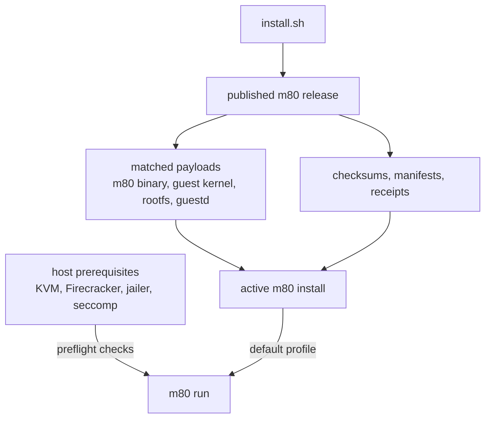
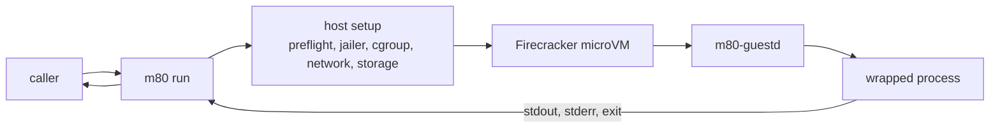
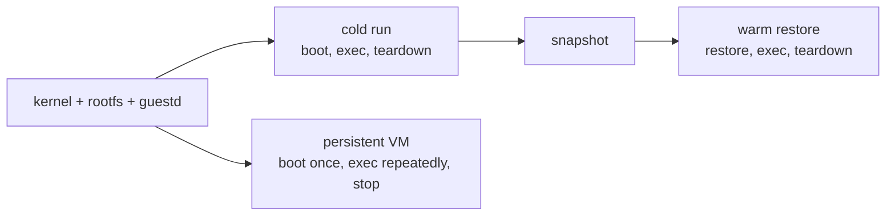
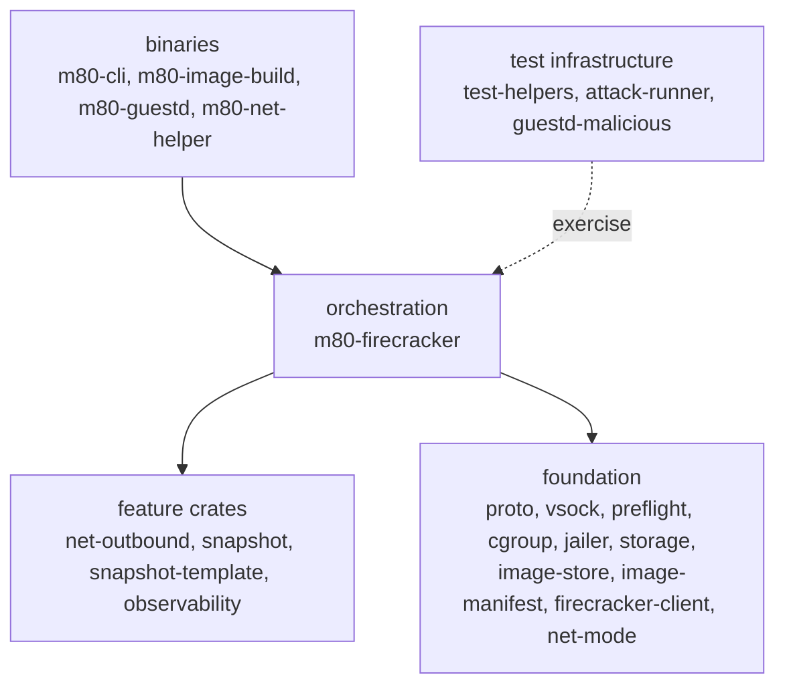

# m80 Diagrams

These diagrams are visual orientation for the main README. The quickstart stays
command-first; this page shows what those commands drive.

## Install Product Shape

`install.sh` selects one published release, verifies it, installs the matched
m80 binary plus VM payloads, and writes the default profile that `m80 run` uses.
KVM, Firecracker, jailer, and seccomp stay host prerequisites and are checked by
preflight.

## Process Wrapper Path

`m80 run` wraps one process in one Firecracker microVM and returns stdout,
stderr, and exit status like a normal local command.

## Lifecycle Choices

The CLI exposes cold `m80 run`. Warm restore and persistent VM control are
library or warm-owner surfaces for callers that need lower latency.

## Workspace Stack

m80 is split into 23 crates. The stack is intentionally narrow: binaries at the
top, `m80-firecracker` as the orchestration point, and foundation crates below.

